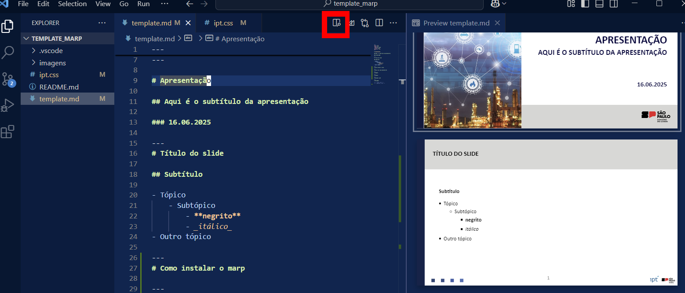
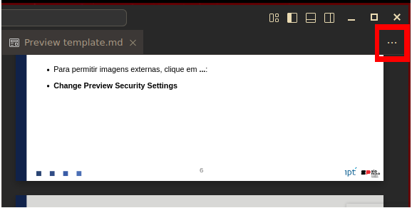

# Apresentação

## Aqui é o subtítulo da apresentação

### 16.06.2025

---
# Título do slide

## Subtítulo

- Tópico
    - Subtópico
        - **negrito**
        - _itálico_
- Outro tópico

---
# Como instalar o marp

- O Marp deve ser instalado utilizando a aba extensões do VSCode.

- Clique em extensões e procure **Marp for VSCode**.

- Para os slides aparecerem é necessário adicionar o cabeçalho no topo do arquivo.

---
# Como criar uma apresentação

- Clique em **Arquivo > Abrir pasta** e abra uma pasta com o template do Marp.

- Clique em **Arquivo > Novo arquivo de texto** e crie um arquivo com extensão .md.
    - **exemplo.md**

---
# Visualizando a apresentação

- Para visualizar um _preview_ da apresentação, clique no ícone no topo do VSCode:



- Um painel do lado direito será aberto mostrando uma preview.

---
# Imagens

- Imagens podem ser adicionadas à apresentação de forma interna ou usando urls de sites (externa).


---
# Imagens

- Para permitir imagens externas, clique em **...**



- **Change Preview Security Settings > Allow insecure content**

---
# Imagens

- O comprimenro e altura das imagens podem ser regulados com as propriedades **width** e **height**.


---
# Tabelas

- Tabelas podem ser criadas utilizando a sintaxe Markdown:

<center> <!--  A tag center centraliza a tabela -->

| **Coluna 1** | **Coluna 2** | **Coluna 3** | **Coluna 4** | 
|:------------:|:------------:|:------------:|:------------:|
|       1      |       2      |       3      |       4      | 
|       5      |       6      |       7      |       8      | 
|       9      |      10      |      11      |      12      | 
</center>

---
# Tabelas

- Tabelas também podem ser criadas com a sintaxe HTML.

<center>
<table border=1>
<tr><th> Coluna 1 </th>
    <th> Coluna 2 </th>
    <th> Coluna 3 </th>
    <th> Coluna 4 </th></tr>

<tr><td> 1 </td>
    <td> 2 </td>
    <td> 3 </td>
    <td> 4 </td> </tr>

<tr><td> 5 </td>
    <td> 6 </td>
    <td> 7 </td>
    <td> 8 </td> </tr>

</table>
</center>

- Tabelas em geral podem ser geradas no site:
    - https://www.tablesgenerator.com/


---
# Código

- Painéis de código de múltiplas linguagens podem ser adicionados:
```python
# Exemplo de código

if linguagem == "python":
    print("Existe suport para Python")
```

---
# Gerando o pdf

- Clique no símbolo do Marp no menu superior e escolha a opção **Export Slide Deck**.


---
# O que falta

- Slides com múltiplas linhas / colunas.


---
# Esse é o slide final. Obrigado!

<!--Slide de encerramento.
    As duas linhas abaixo precisam ser mantidas
    para identificar o slide de encerramento. -->
<!-- _class: last -->
<!-- _paginate: skip -->
