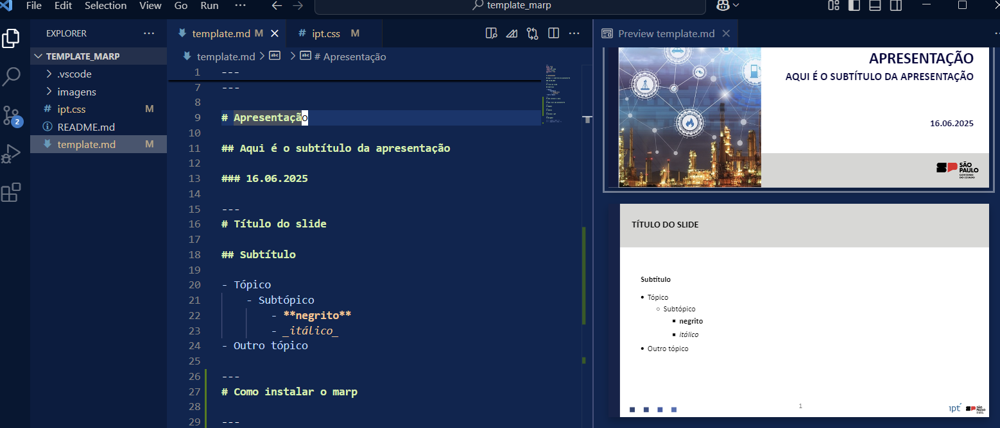

# Apresentação

## Aqui é o subtítulo da apresentação

### 16.06.2025

---
# Título do slide

## Subtítulo

- Tópico
    - Subtópico
        - **negrito**
        - _itálico_
- Outro tópico

---
# Como instalar o marp

---
# Como criar uma apresentação

---
# Visualizando a apresentação


---
# Imagens

---
# Tabelas

| Coluna 1 | Coluna 2 | Coluna 3 | Coluna 4 |
|----------|----------|----------|----------|
| 1        | 2        | 3        | 4        |
|          |          |          |          |
|          |          |          |          |

---
# Código

```python
# Exemplo de código

if x < 10:
    print("aaa)
```

---
# Gerando o pdf

- Clique no símbolo do MARP no menu superior e escolha a opção **Export Slide Deck**.



---
# Obrigado!

<!--Slide de encerramento.
    As duas linhas abaixo precisam ser mantidas
    para identificar o slide de encerramento. -->
<!-- _class: last -->
<!-- _paginate: skip -->
